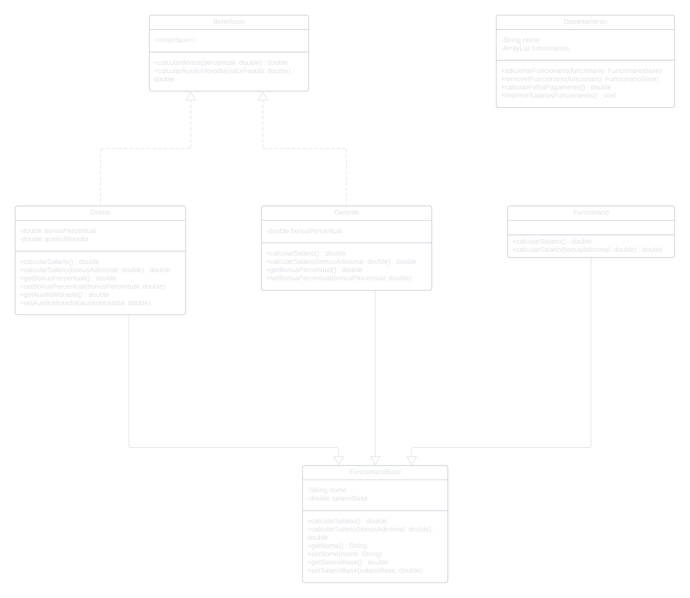

# AC2: Sistema de Gestão de Funcionários

## Objetivo
O objetivo desta avaliação é implementar um sistema de gestão de funcionários utilizando os conceitos de programação orientada a objetos (POO), como herança, polimorfismo, interfaces, sobrescrita e sobrecarga de métodos, entre outros. O sistema permite a criação de diferentes tipos de funcionários (Funcionário, Gerente e Diretor), o cálculo de seus salários e a gestão de um departamento com diversos funcionários.

## Diagrama de Classes


## Implementação
### Classes:

#### FuncionarioBase:
- Atributos protegidos: nome (String), salarioBase (double)
- Método abstrato calcularSalario()
- Método sobrecarregado calcularSalario(bonusAdicional: double)
- Getters & Setters
#### Funcionario:
- Herda de FuncionarioBase
- Implementa calcularSalario()
#### Gerente:
- Atributo protegido: bonusPercentual (double)
- Herda de FuncionarioBase
- Implementa calcularSalario()
- Implementa a interface Beneficios
- Getters & Setters
#### Diretor:
- Atributos protegidos: bonusPercentual (double), auxilioMoradia (double)
- Herda de FuncionarioBase
- Implementa calcularSalario()
- Implementa a interface Beneficios
- Getters & Setters
#### Beneficios:
- Interface com métodos calcularBonus(percentual: double) e calcularAuxilioMoradia(valorFixado: double)
#### Departamento:
- Atributos: nome (String), funcionarios (ArrayList<FuncionarioBase>)
- Métodos: adicionarFuncionario(), removerFuncionario(), calcularFolhaPagamento(), imprimirSalariosFuncionarios()

### PSVM (Main):

``` java
public class Main {

    public static void main(String[] args) {

        Departamento tecnologia = new Departamento("Tecnologia");

        Funcionario f1 = new Funcionario("João", 3_000);
        Gerente g1 = new Gerente("Maria", 5_000, 20);
        Diretor d1 = new Diretor("Carlos", 10_000, 30, 2_000);

        tecnologia.adicionarFuncionario(g1);
        tecnologia.adicionarFuncionario(d1);
        tecnologia.adicionarFuncionario(f1);

        tecnologia.imprimirSalariosFuncionarios();

        System.out.printf("\nFolha de pagamento -> %s", tecnologia.getNome() +
                        ": R$" + tecnologia.calcularFolhaPagamento() + "\n\n");

        Funcionario f2 = new Funcionario("José", 3_000);

        tecnologia.adicionarFuncionario(f2);
        tecnologia.exibirFuncionarios();

        System.out.printf("\nFolha de pagamento -> %s", tecnologia.getNome() +
                ": R$" + tecnologia.calcularFolhaPagamento() + "\n\n");

        tecnologia.removerFuncionario(f2);
        tecnologia.exibirFuncionarios();
    }
}
```

## Saída
```
Adicionado Maria ao departamento Tecnologia
Adicionado Carlos ao departamento Tecnologia
Adicionado João ao departamento Tecnologia

--------Salários: Tecnologia--------

Gerente: Maria
Salário: R$6000.0

Diretor: Carlos
Salário: R$15000.0

Funcionário: João
Salário: R$3000.0

----------------------------------------

Folha de pagamento -> Tecnologia: R$24000.0

Adicionado José ao departamento Tecnologia

--------Departamento Tecnologia--------

Gerente: Maria
Diretor: Carlos
Funcionário: João
Funcionário: José

----------------------------------------

Folha de pagamento -> Tecnologia: R$27000.0

Removido José do departamento Tecnologia

--------Departamento Tecnologia--------

Gerente: Maria
Diretor: Carlos
Funcionário: João

----------------------------------------

Process finished with exit code 0
```

## Conclusão
O sistema demonstra a aplicação de polimorfismo, permitindo que o método imprimirSalariosFuncionarios() seja utilizado para imprimir os salários de qualquer tipo de funcionário, independentemente de ser um Funcionário, Gerente ou Diretor. 
A interface Beneficios permite a reutilização de código para o cálculo de bônus e auxílio-moradia.